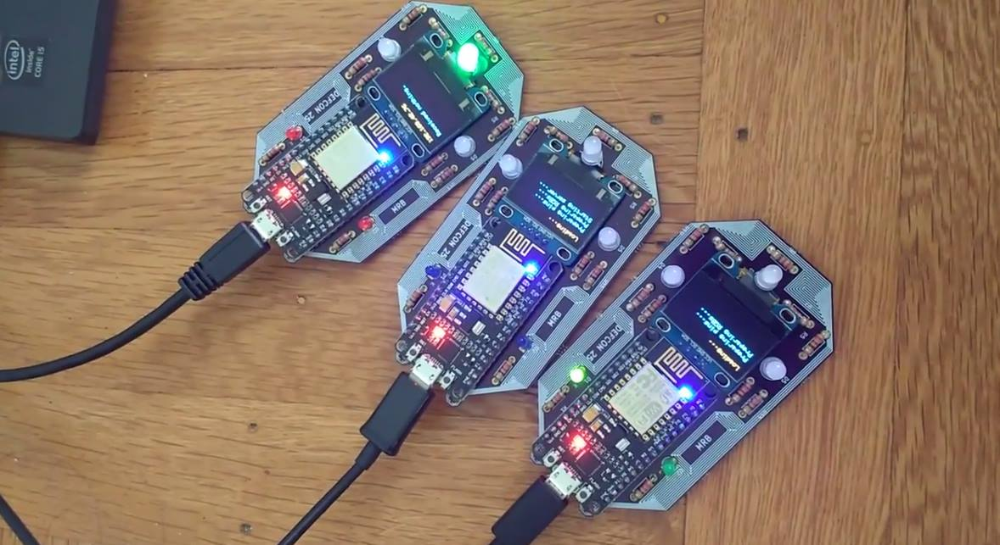

# DEFCON 25 Custom Badge
Custom PCB design and code for DefCon 25 badge.
Credits to @mschuldt for help with the PCB design.

## Demo Video
[Link to Demo Video](https://www.youtube.com/watch?v=TrFcW3AFYnM)

## Why was this built?
For fun. Also I just wanted to learn how to do something I don't know how to do. At all.

## Designing the Custom PCB
Coming up with the final design took about 5 months of continuous redesigning and prototyping.
It also took a long time mostly because I didn't know anything about EE before this project. :)
The main goals of the PCB was that we would be able to fit all the components desired within
the smallest surface area possible, while also looking pleasant and something you'd want to
wear around your neck.

## What does it do?
- Each individual badge will connect to (unfortunately) hardcoded WiFi network.
- Once connected to a WiFi network, the badges will try to find their "sibling" badges by broadcasting itself on the network.
- A badge will never learn a sibling badge twice, but will try to find as many nearby siblings as possible.
- When a badge knows of at least one sibling in nearby viscinity it will start communicating.
- All badges will communicate to each other independently, and all badges will communicate to all other badges that is learned.

## Required Components for Assembly (per badge)
- Custom PCB printed by fab of your choice
  - For this badge, I used [Oshpark](https://oshpark.com/)
  - `vers2_cheaper.kicad_pcb` is the KiCAD file you can upload.
- [SSD1306 OLED Screen](https://www.amazon.com/gp/your-account/order-history?ie=UTF8&ref_=ya_d_c_yo&)
- [ESP8266 NodeMCU](https://www.amazon.com/gp/product/B010O1G1ES/ref=oh_aui_detailpage_o07_s00?ie=UTF8&psc=1)
- 220 Ohm resistors x 11
- RGB LED x 3
- 3mm LED x 2
- [3.7v 500mAh LiPo battery](https://www.adafruit.com/product/1578)
- Male microUSB connector, part only

## How to Assemble
- Basically solder on all the parts.
- Flash ESP with the arduino code using Arduino IDE version 1.6.4 and above
  - To compile correctly, you must have these libraries installed:
    - Adafruit_GFX_Library
    - Adafruit_SSD1306 Library 
    - Use board manager to install ESP modules. You'll be using the NodeMCU 1.0 ESP 12E board module.
  - You must flash in NodeMCU 1.0 ESP 12E mode. This mode has all the settings you need for the board so you should not have to touch anything.
- The battery does need manual assembly:
  - Clip off the JST end off of the LiPoly battery and solder onto the male microUSB part. 

## Useful Links
- [Pin mapping woes when addressing NodeMCU ESP GPIO pins in Arduino](https://github.com/esp8266/Arduino/issues/584)
- [If you accidentally "brick" your ESP and need to undo the damage](https://github.com/espressif/esptool/issues/213)
- [How to best work with SSD1306](http://arduino-er.blogspot.com/2016/04/nodemcu-esp8266-to-display-on-128x64.html)

